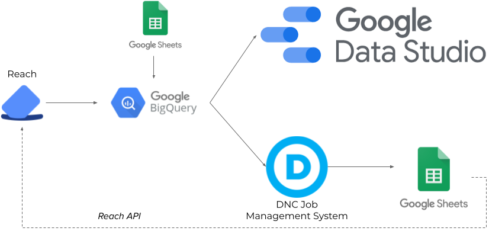

# Reach

This directory contains code related to the Reach API. Most of these are AppScript
scripts (extension `.gs`) or SQL queries (extension `.sql`). 

The file `oauth.gs` has general helper functions for interacting
with the Reach API, while `config.gs` will contain your particular configuration variables (e.g., your Reach API username and password).

The pipeline that tags voters in Reach with their AV/EV status is in `tags.gs`.
This is an AppScript that ran a few functions on time-triggers, pulling data from spreadsheets which were updated hourly using the DNC job management system. The data flow generally looked like

Another pipeline ensured our user groups were up-to-date. We had separate user groups for
paid and volunteer relational canvassers, and we used a similar AppScript trigger pipeline
to keep those groups up-to-date. The user groups were useful in sending push notifications
to only subsets of users.

The python scripts were one-off helper scripts that were run locally as needed. 
AppScript has strict time limits, so for any one-time, long-running process, a local
script works better. For example, the code that tagged all voters only reachable
by the Reach user is in `tag_uncontactable.py`  -- it took a couple of hours to run. I also sometimes used python scripts to update AV/EV tags in Reach, when the AppScript pipeline was far behind (these scripts are messy and so not shared in this repository).

There's definitely some unifying and cleaning of code that could be done here, but hopefully this is a helpful start.
